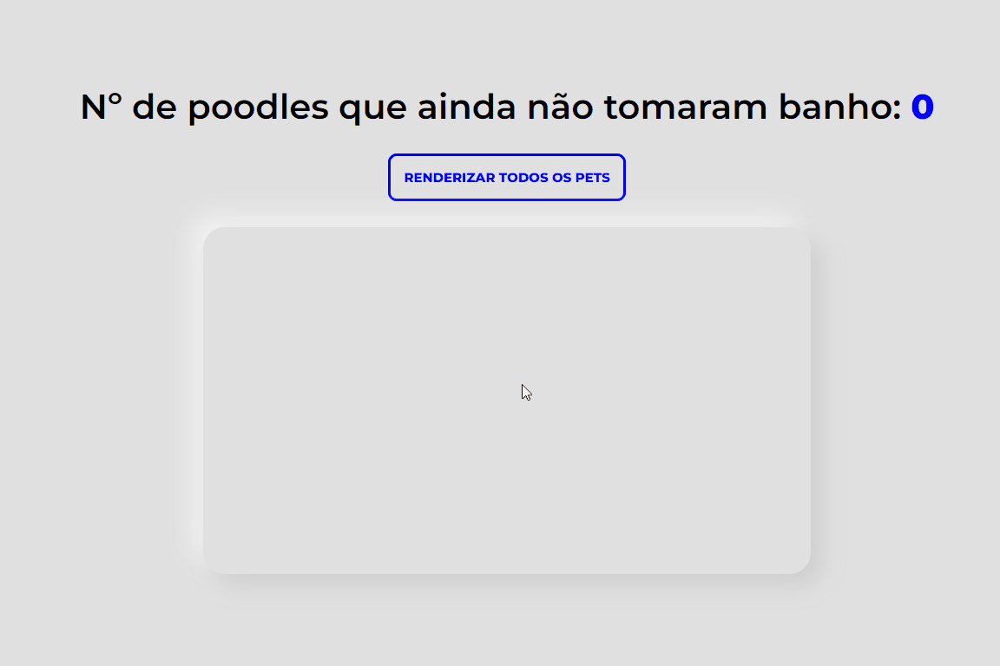

# Instruções

Essa aplicação tem como objetivo **testar os seus conhecimentos com HTML, CSS e JS básicos**!

### ⏱️ Duração do teste

> `5 minutos para leitura + 15 minutos para todo o desenvolvimento`

### 🐛 Debugging

> `É permitido testar o seu código usando console.log() ou debug (o que preferir)`

### 🔎 Pesquisas

> `É permitido qualquer tipo de pesquisa, desde que seja apenas em documentações oficiais, como MDN e W3School!`

## 🚨 Atenção

Esse projeto possui todos os arquivos necessários para desenvolver a solução esperada, então **NÃO SERÁ NECESSÁRIO CRIAR OUTROS ARQUIVOS**. São eles:

- [`index.js`](./src/scripts/index.js.js), dentro da pasta `src/scripts`, terá toda a parte lógica do seu código.
- [`yourStyle.css`](./src/styles/yourStyle.css), dentro da pasta `src/styles`, terá a parte de estilos feita por você.

Mas caso ache pertinente, fique a vontade para olhar os outros arquivos, mas **NÃO FAÇA NENHUMA ALTERAÇÃO**:

- [`database.js`](./src/scripts/database.js), dentro da pasta `src/scripts`, tem toda a base de códigos no qual precisá usar.
- [`globalStyles.css`](./src/styles/globalStyles.css), dentro da pasta `src/styles`, tem toda a estilização CSS base pronta.
- [`index.html`](./index.html), dentro da pasta raiz, tem toda a estrutura HTMLm e com algumas classes já predefinidas.

E é de extrema importância que você **desenvolva seguindo o que será pedido nesse README** para que as estilizações funcionem como esperado!

# Problema

Recebemos um código que está incompleto e precisamos da sua ajuda: temos que **terminar de desenvolver a aplicação para que fique igual ao GIF abaixo**:

## 🎲 Desafio

Adicione um _listener_ de evento de `click` ao botão com texto **`Renderizar todos os pets`**, que, ao ser clicado, precisará renderizar todas os pets presentes no [`database.js`](./src/scripts/database.js) dentro da `section` e atualizar o número de poodles que ainda não tomaram banho dentro do `span`.

Os cards renderizados de cada pet devem seguir a seguinte estrutura:

- `div` | Container principal do card _(Necessário ter a classe **`card`**)_
  - `h2` | Nome do pet
  - `p` | Raça do pet

_Obs.: A `section` deverá ser limpa a cada execução._

Lembrando que a sua solução lógica, desenvolvida em [`index.js`](./src/scripts/index.js.js), deverá estar dentro de uma única função, chamando-a em seguida!

## 🖌️ Estilização

Todas as **estilizações base já estão prontas** no arquivo [`globalStyles.css`](./src/styles/globalStyles.css), ou seja, você não precisa se preocupar com elas caso tenha feito conforme solicitado acima!

A única coisa que será necessário fazer é o **alinhamento dos cards dentro da `section` usando `flex`**, como mostrado no GIF, por isso utilize o arquivo [`yourStyle.css`](./src/styles/yourStyle.css), que está dentro da pasta `src/styles`.

---

> **Bom desenvolvimento**, e qualquer dúvida só perguntar ao seu aplicador 😉!
